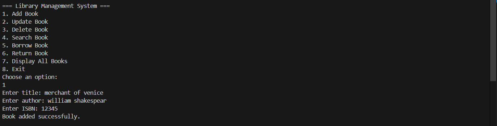
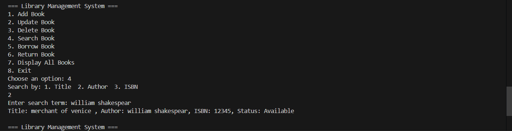
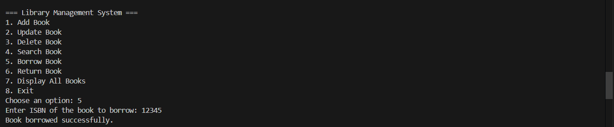
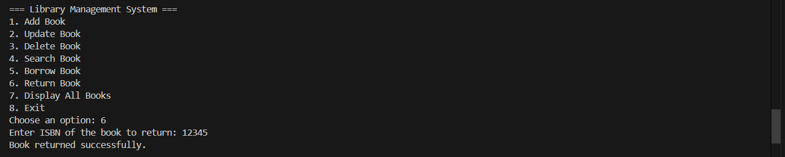

# Library Management System 📚
A console-based Library Management System built in Java that allows users to add, update, delete, search, borrow, and return books. The program uses object-oriented concepts like classes, objects, and collections to manage book data efficiently.

## **Features** ✨  

- **Add Books**: Add new books with details like title, author, genre, and publication year.  
- **Update Books**: Modify existing book details.  
- **Delete Books**: Remove books from the library.  
- **Search Books**: Search for books by title, author, or genre.  
- **Borrow Books**: Mark a book as borrowed by a user.  
- **Return Books**: Mark a book as returned to the library.  
- **View All Books**: Display all books currently available in the library.

## **How It Works** 💻  

- **Add a Book**:  
  The user can input the book's details, which are stored in a collection.  
    

- **Search for a Book**:  
  The user can search for books by title, author, or genre, and the system will display the matching results.  
    

- **Borrow/Return a Book**:  
  The system updates the status of a book (borrowed/available) based on user actions.  
    
    

## **Author** 🧑‍💻  

- **Manas Dwivedi**: Developer of this project.  
 

